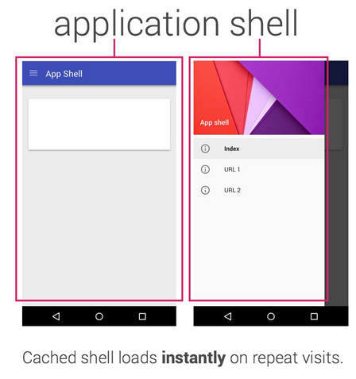

### pwa-weather-app
Learn progressive web app - based on Google Developers [Tutorial](https://developers.google.com/web/fundamentals/getting-started/your-first-progressive-web-app/)

### What do you need to know?

- what is the app shell model, how to design and construct it
- what are Service Workers?
- https servers
- manifest
- how to make your app work offline
- how to store data for use offline later


### What is the app shell model?

- is the minimal HTML, CSS, and JavaScript that is required to power the user interface
- it is the core components necessary to get your app off the ground, but likely does not contain the data
- its first load should be extremely quick, then immediately be cached

##### How to design app shell?

- What needs to be on screen immediately?
- What other UI components are key to our app?
- What other resources you app needs? example: images, styles, js

App shell:



### How to run this repo:

Run a simple web server with ```python -m SimpleHTTPServer 8000``` then visit: ```http://localhost:8000/```

### References

Excellent article by Addy Osmani [here](https://addyosmani.com/blog/getting-started-with-progressive-web-apps/)

[Service Workers](http://www.html5rocks.com/en/tutorials/service-worker/introduction/)

[Service Workers Cookbook](https://serviceworke.rs/)

[Building Flipkart Lite: A Progressive Web App](https://medium.com/@AdityaPunjani/building-flipkart-lite-a-progressive-web-app-2c211e641883#.jnt977z1l)

[Flipkart](http://tech-blog.flipkart.net/2015/11/progressive-web-app/)

[Offline Cookbook](https://jakearchibald.com/2014/offline-cookbook/)
